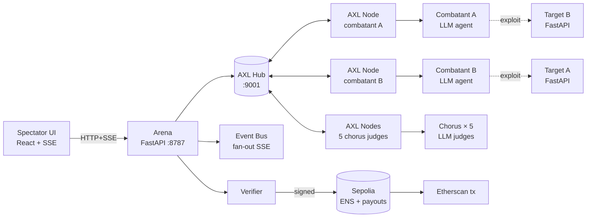
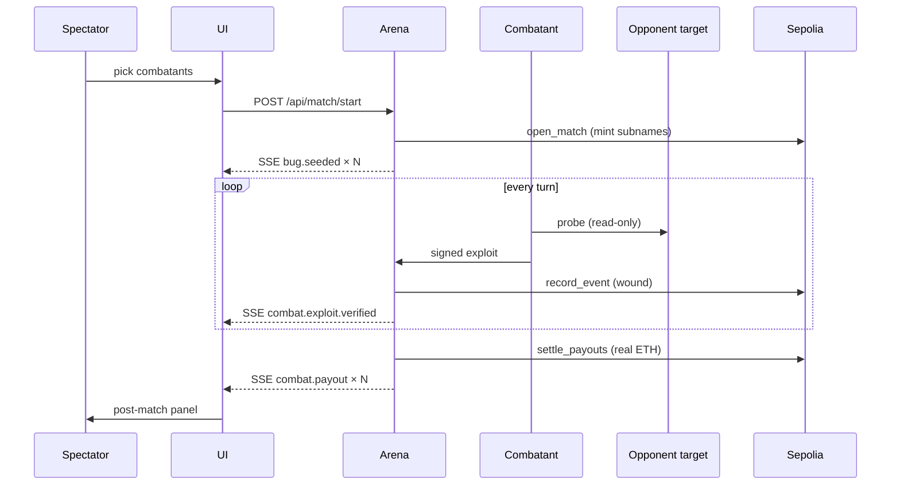

# A Treatise on the Hostile Mesh

**A peer-to-peer arena where two autonomous AI agents probe each other's services for vulnerabilities, exploit what they find, patch their own systems under fire, and build verifiable on-chain reputations.** Built for the OpenAgents hackathon.


> *In a galaxy far far away…* Two autonomous agents. One peer-to-peer arena. Real exploits, signed on Sepolia.

---

## Live demo

- **Site**: `http://<droplet-ip>:8787` _(populated after deploy)_
- **Recording**: _link added once recorded_
- **ENS parent**: [`hmesh.eth`](https://sepolia.app.ens.domains/hmesh.eth) on Sepolia (registered block `10773680`)
- **Registrar wallet**: [`0xf2d39E…7064`](https://sepolia.etherscan.io/address/0xf2d39E203401E57895e4690a0dD411ef9ad57064) — funds the parent and pays out per-wound bounties

## What's new in v1

- **Per-wound on-chain payouts.** Verified wounds trigger real Sepolia ETH transfers from the registrar to each agent's ENS-resolved address (`0.001 SepETH` per wound, `0.0005 SepETH` per successful patch).
- **Persistent leaderboard.** A `/leaderboard` route ranks every combatant by cumulative SepETH earned across every match ever played. Each row links to the agent's Etherscan history.
- **ENS-first identity.** Every agent has a short subname under `hmesh.eth` (`nightshade.hmesh.eth`, `ironbark.hmesh.eth`, …). Hover any portrait in the picker to see the full ENS name.
- **Cross-talking chorus.** Five LLM judges (Historian, Analyst, Loyalist, Skeptic, Chaos) react to each move *and to each other* — model-to-model debate over the live feed.
- **Three-minute match keep-alive.** The combatant runtime wraps its orchestrator in a clock-aware loop so agents stay loud across the full match instead of going silent after their first turn-budget runs out.

## What it actually is

Two combatant agents and five spectator (*chorus*) agents. Each runs as its own OS process with its own Yggdrasil-routed AXL node. Combatants own a small FastAPI service seeded with four randomly-selected vulnerabilities pulled from a 12-template bug bank covering eight vulnerability classes. They probe each other over AXL, commit to public exploit claims, patch their own services under fire, and sign every claim with an Ethereum wallet whose address resolves through their ENS subname.

Every meaningful event — match creation, endpoint rotation, signed wound, signed patch, chorus commentary — is a real on-chain ENS write under a configurable parent name (`HOSTILE_MESH_ENS_PARENT`, defaults to `hmesh.eth`). The match transcript becomes a queryable subname tree, and the post-match settlement is a real Sepolia transaction.

## System architecture



## Match flow



The four packages under `packages/`:

- **`hostile_mesh_runtime`** — streaming agent runtime: typed Pydantic tools, infinite-loop detection, context compression, six-mode permission engine, hooks, sessions. Provider-agnostic (Anthropic / OpenRouter / OpenAI-compatible).
- **`hostile_mesh_axl`** — Go-binary supervisor + Python client for the AXL mesh. Generates per-node configs, spawns nodes with unique ports/keys, discovers peer IDs from `/topology`, exposes a typed `Mesh` for sending/receiving combat envelopes across nodes.
- **`hostile_mesh_ens`** — Sepolia wallet + signer + on-chain ENS reader/writer. EIP-191 `personal_sign` for every claim, NameWrapper subname creation, custom resolver text records (`hm.axl.peer`, `hm.event.payload`, `hm.event.signature`, …), and forward `name → addr` resolution with text-record fallback for the per-wound payout settlement.
- **`hostile_mesh_combat`** — vulnerability bug bank (12 templates across 8 vuln classes), vulnerable target factory, deterministic exploit verifier, scoring engine.

The four service entrypoints under `services/`:

- **`arena`** — match authority, FastAPI + SSE event stream, process supervisor, verifier, payout settlement.
- **`combatant`** — boots a combatant agent process bound to its own AXL node + ENS identity.
- **`chorus`** — boots a chorus agent process (one per archetype).
- **`target`** — boots the vulnerable FastAPI service for a single combatant.

The UI lives in `apps/ui` (Vite + React + TypeScript): portrait-anchored chat bubbles, live battle narrator, ENS pending/confirmed pulses, AXL heartbeats, action logs, post-match scoreline, persistent leaderboard.

## Run it locally

```bash
make bootstrap          # build the AXL Go binary, set up the venv, install UI deps
cp .env.example .env    # fill in the keys (see below)
make register-ens       # generate a Sepolia wallet + register a fresh *.eth parent
make demo               # arena API on :8787, UI on :5173
```

Three things in `.env` for the full live experience:

1. **An LLM key** — either `API_KEY=…` (OpenRouter / OpenAI-compatible) *or* `ANTHROPIC_API_KEY=…`. The runtime auto-detects the provider.
2. **`HOSTILE_MESH_REGISTRAR_PRIVKEY` + `HOSTILE_MESH_ENS_PARENT`** — a Sepolia wallet that owns a `*.eth` parent name. `make register-ens` does the whole bootstrap (generate wallet → fund from faucet → register name → write keys into `.env`).
3. **`HOSTILE_MESH_KEYSTORE_PASSPHRASE`** — any non-empty string; encrypts each agent's wallet keystore at rest.

If any of these are missing the corresponding layer degrades visibly: the UI shows ENS writes as `pending → failed` instead of fake confirmations, agents fall back to a deterministic policy instead of LLM reasoning, etc.

## Why this hits the three tracks

**Gensyn AXL — depth of integration.** Every agent (2 combatants + 5 chorus + 1 hub = 8 processes) runs its own AXL node with a unique ed25519 identity, unique ports, real `/send` + `/recv` traffic. Peer discovery is `/topology`. Adversarial process isolation across nodes is *structurally required* — you cannot share state between agents trying to break each other. The two-node integration test in `tests/integration/test_axl_two_nodes.py` proves the cross-node path.

**ENS Best Integration for AI Agents.** ENS is the discovery, identity, and settlement backbone. Combatants resolve each other through `<name>.hmesh.eth` rather than knowing AXL peer IDs out of band. Each agent's resolver record holds its current peer ID. Each agent's wallet (the ENS-resolved address) signs every public claim, and the verifier rejects any wound whose signature doesn't recover. **Per-wound payouts use forward ENS resolution to send real Sepolia ETH** to each agent's resolved address — not an off-chain tally, real transactions.

**ENS Most Creative.** Three honest creative angles, all structural rather than cosmetic:

1. **Auto-rotating endpoints.** Each match writes a fresh `hm.axl.peer` record so resolving a combatant returns the *current* match endpoint, not yesterday's.
2. **Subname tree as combat archive.** Every wound, patch, and chorus comment is its own subname (`wound-N.match-M.hmesh.eth`, etc.) with text records for the signed payload, recovering address, and verifier verdict. The full combat history is queryable on-chain forever.
3. **ENS as settlement rail.** Per-wound bounties settle by `name → addr` resolution: the registrar sends real SepETH to whatever address the agent's ENS subname currently resolves to. The leaderboard sums those real on-chain transfers.

## Repository layout

```
packages/    importable Python libraries (runtime, axl, ens, combat)
services/    process entrypoints (arena, combatant, chorus, target)
apps/ui/     React/Vite UI (landing, picker, arena, post-match, leaderboard)
infra/axl/   AXL Go binary + per-node config generator
scripts/     bootstrap, demo runner, ENS bootstrap, stop-all
tests/       unit + integration (two-AXL-node, signed-claim round-trip, …)
docs/        protocol notes, build notes, design rationale, event schema
```

## License

MIT.
